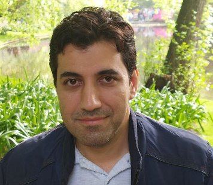

# Vahid Jahandideh

I'm a PhD student at the [Radboud University, digital security group](https://www.ru.nl/dis/), working on practical aspects of leakage resilient  designs and side-channel attacks.
My supervisors are [Lejla Batina](https://www.cs.ru.nl/~lejla/) and [Bart Mennink](https://www.cs.ru.nl/~bmennink/). I'm also part of [CESCALAB](https://cescalab.cs.ru.nl/) which is specialized in performing various side-channel analyses and implementations.

Before that, I was a researcher at [Sharif University in Iran](https://en.sharif.edu/).

## Publications  
- Vahid Jahandideh, Bart Mennink, Lejla Batina, [An Algebraic Approach for Evaluating Random Probing Security With Application to AES](https://tches.iacr.org/index.php/TCHES/article/view/11806), IACR Transactions on Cryptographic Hardware and Embedded Systems (2024)
- Vahid Jahandideh, Léo Weissbart, Bart Mennink, Lejla Batina, [A New Leakage Exploitation Framework and Its Application to Authenticated Encryption](https://csrc.nist.gov/csrc/media/Events/2023/lightweight-cryptography-workshop-2023/documents/accepted-papers/05-a-new-leakage-exploitation-framework.pdf). NIST Lightweight Cryptography Workshop. (2023)
- Vahid Jahandideh, [Concrete Evaluation of the Random Probing Security](https://eprint.iacr.org/2021/859). IACR Cryptol. ePrint Arch. (2021)
- Vahid Jahandideh, [Verification of the security in Boolean masked circuits](https://eprint.iacr.org/2021/860). IACR Cryptol. ePrint Arch. (2021)
